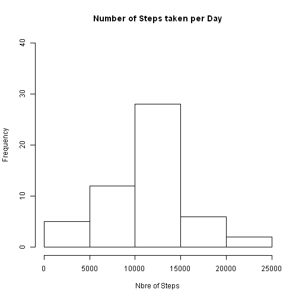
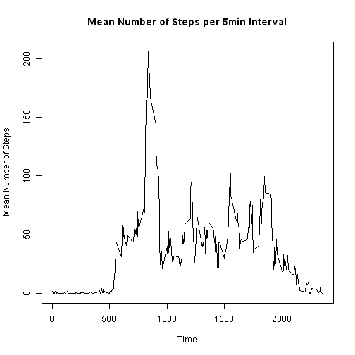
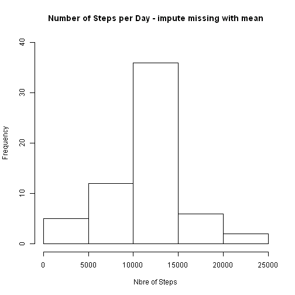
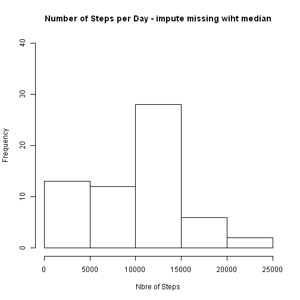
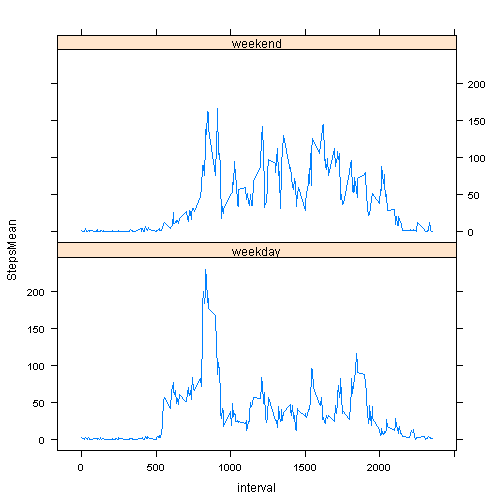

# Reproducible Research: Peer Assessment 1
## Introduction
In this exercise, we are going to use data from a personal activity monitor device.

This device records the number of steps done through out the day. Each 5 minutes the number of steps performed are recorded.

The data has the information from an anonymous person taken during October and November 2012.

## Loading and preprocessing the data

Load needed packages:

```r
library(lattice)
```

```
## Warning: package 'lattice' was built under R version 3.0.3
```


The data is loaded from file 'activity.csv' into activity.

A new data set is created without any missing values ('act_nona')


```r
path <- "E:/DATA/Thomas/Coursera/GitHub/Reproducible Research"
setwd(path)
activity <- read.csv("activity.csv")
good <- which(!is.na(activity$steps))
act_nona <- activity[good, ]
```


## What is mean total number of steps taken per day?

Create an histogramme from the total steps per day. Using 5 Breaks.

calculate the mean and median from the total steps per day.


```r
somme <- sapply(split(act_nona$steps, act_nona$date, drop = TRUE), sum)
hist(somme, breaks = 5, main = "Number of Steps taken per Day", xlab = "Nbre of Steps", 
    ylim = c(0, 40))
```

 

```r
moyenne <- mean(somme)
median <- median(somme)
```


The <b>mean</b> value is 1.0766 &times; 10<sup>4</sup> and the <b>median</b> value is 10765

## What is the average daily activity pattern?

Calculate the mean for each 5 minutes interval across all days (mean_interval).

Plot the mean_interval to show the walking activities during the day.


```r
mean_interval <- sapply(split(act_nona$steps, act_nona$interval, drop = TRUE), 
    mean)
median_interval <- sapply(split(act_nona$steps, act_nona$interval, drop = TRUE), 
    median)
plot(x = names(mean_interval), y = mean_interval, type = "l", main = "Mean Number of Steps per 5min Interval", 
    xlab = "Time", ylab = "Mean Number of Steps")
```

 

```r
max_steps <- names(mean_interval[mean_interval == max(mean_interval)])
```


The maximum of steps in a 5 minutes interval is found in interval 835 with 206.1698 steps.

## Imputing missing values

The original data set contains 2304 missing values for 'steps'.

We will replace these missing values by the corresponding average 'activity$steps_imput_mean' and median 'activity$steps_imput_median' steps across all days for the 5 minutes interval:


```r
missing_rec <- which(is.na(activity$steps))
imputing_missing <- function(activity, intervals) {
    imput_steps <- matrix(nrow = length(activity$steps), ncol = 1)
    for (i in 1:length(activity$steps)) {
        if (is.na(activity[i, 1])) {
            imput_steps[i, 1] <- intervals[as.character(activity[i, 3])]
        } else {
            imput_steps[i, 1] <- activity[i, 1]
        }
    }
    imput_steps
}
activity$steps_imput_mean <- imputing_missing(activity, mean_interval)
activity$steps_imput_median <- imputing_missing(activity, median_interval)
```


and create an histogram with the imputed values for NA using the mean or the median values:

```r
somme_impute_mean <- sapply(split(activity$steps_imput_mean, activity$date, 
    drop = TRUE), sum)
somme_impute_median <- sapply(split(activity$steps_imput_median, activity$date, 
    drop = TRUE), sum)
hist(somme_impute_mean, breaks = 5, ylim = c(0, 40), main = "Number of Steps per Day - impute missing with mean", 
    xlab = "Nbre of Steps")
```

 

```r
hist(somme_impute_median, breaks = 5, ylim = c(0, 40), main = "Number of Steps per Day - impute missing wiht median", 
    xlab = "Nbre of Steps")
```

 

```r
values <- c(mean(somme), mean(somme_impute_mean), mean(somme_impute_median), 
    median(somme), median(somme_impute_mean), median(somme_impute_median))
median_mean <- matrix(data = values, ncol = 2, nrow = 3)
dimnames(median_mean) <- list(c("Without NAs", "Impute value using mean", "Impute value using median"), 
    c("Mean", "Median"))
```


The <b>mean</b> and <b>median</b> values represented in table below for all 3 approach:


```r
median_mean
```

```
##                            Mean Median
## Without NAs               10766  10765
## Impute value using mean   10766  10766
## Impute value using median  9504  10395
```

<i><b>Without NAs</b></i>: mean and median for data where missing values were removed from calculation.<br>
<i><b>Impute value using mean</b></i>: mean and median for data where missing values were replaced by mean values of corresponding 5 minutes interval.<br>
<i><b>Impute value using median</b></i>: mean and median for data where missing values were replaced by median values of corresonding 5 minutes interval.<br>

Imputing missing value using the mean value for each 5 minutes interval has low impact on the mean and median values. However, the historgram shows that the ferquency of days with number of steps between 10'000 and 15'000 is increased.

Imputing missing value using the the median value for each 5 minutes interval drastically increases the number of days where number of steps are between 0 and 5'000.

## Are there differences in activity patterns between weekdays and weekends?

Add column in the activity dataset with value 'weekends' or 'weekdays' depending on the day the measurment was done:


```r
activity$days <- weekdays(as.POSIXct(activity$date))
activity$weekday <- sapply(activity$days, function(x) {
    if (x %in% c("samedi", "dimanche")) 
        "weekend" else "weekday"
})
```


And  plot the number of steps per 5 minutes interval grouped by type of days (weekdays or weekend days):


```r
split_activity <- split(activity, as.factor(activity$weekday))

weekday <- data.frame(StepsMean = sapply(split(split_activity[[1]][, 4], split_activity[[1]][, 
    3]), mean), DayType = names(split_activity[1]))
weekday$interval <- as.numeric(row.names(weekday))

weekend <- data.frame(StepsMean = sapply(split(split_activity[[2]][, 4], split_activity[[2]][, 
    3]), mean), DayType = names(split_activity[2]))
weekend$interval <- as.numeric(row.names(weekend))

activity_daytype <- rbind(weekday, weekend)
activity_daytype$DayType <- as.factor(activity_daytype$DayType)

attach(activity_daytype)
xyplot(StepsMean ~ interval | DayType, type = "l", layout = c(1, 2))
```

 

